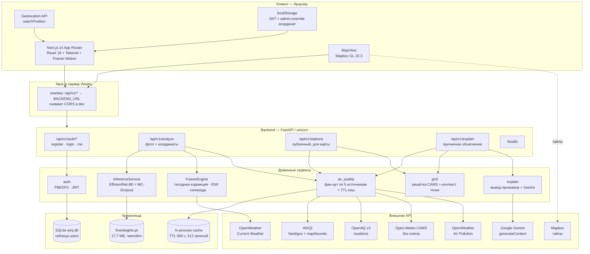

# AirQ — техническая документация

**Разделы 2 и 3 конкурсной заявки.**
Документ описывает фактическую реализацию, находящуюся в этом репозитории (`backend/`, `airq/`, `pm2-5-prediction-vision-mode-train.ipynb`), а не планируемую архитектуру.

Краткая суть продукта: пользователь фотографирует небо, приложение по снимку и координатам оценивает концентрацию PM2.5, сливает эту оценку с данными реальных станций мониторинга и метеоусловиями, показывает AQI, поле загрязнения на карте и связное объяснение причин.

---

# 2. Архитектура, стек и логика ИИ-компонентов

## 2.1 Общая схема



## 2.2 Стек технологий

| Слой | Технология | Версия | Почему именно она |
|---|---|---|---|
| Фронтенд-фреймворк | Next.js (App Router) | 14.2 | SSR-каркас + встроенный прокси-rewrite к бэкенду, снимающий CORS без отдельного шлюза |
| UI | React 18, TypeScript 5.6 | — | Типизированные контракты API в `airq/types/index.ts` |
| Стили | Tailwind CSS 3.4 + собственный `mono.css` | — | Утилитарная база + «монохромный» дизайн-слой |
| Анимация | Framer Motion 11 | — | Фазовые переходы состояний, поле частиц, реагирующее на измеренный AQI |
| Карта | Mapbox GL JS 3.26 | — | WebGL-рендер; растровый слой поля загрязнения + слой точек станций |
| Иконки | lucide-react | — | — |
| Бэкенд | FastAPI + uvicorn (uvloop) | 0.115 / 0.30 | Асинхронный I/O — на один запрос идёт фан-аут в 5 внешних API |
| Конфигурация | pydantic-settings | 2.x | Валидация `.env`, «мягкая деградация» при отсутствии ключей |
| ML | PyTorch 2.x + torchvision | — | EfficientNet-B0, инференс на CPU/CUDA |
| Обработка изображений | Pillow | 10.x | Декод, EXIF-ориентация |
| HTTP-клиент | httpx (async) | 0.27 | `asyncio.gather` по всем источникам |
| Авторизация | PyJWT + hashlib (PBKDF2) | — | Без тяжёлых зависимостей: одна таблица не оправдывает ORM |
| БД | SQLite (stdlib `sqlite3`) | — | Таблица `users`, 4 колонки |
| Обучение модели | PyTorch, scikit-learn, Kaggle GPU | — | См. §2.6 |

## 2.3 Бэкенд: слои и модули

```
backend/app/
├── main.py                # фабрика приложения, lifespan-загрузка модели, CORS, /health
├── config.py              # Settings (pydantic-settings), единый синглтон settings
├── api/
│   ├── deps.py            # current_user — зависимость извлечения JWT
│   └── v1/
│       ├── auth.py        # register / login / me
│       ├── analyze.py     # основной сценарий: фото → AQI
│       ├── stations.py    # данные для карты (публичный)
│       └── explain.py     # объяснение уровня загрязнения
├── ml/
│   ├── model.py           # AirQualityModel: backbone + голова, MC-Dropout
│   ├── preprocessing.py   # ImagePreprocessor: EXIF, resize+crop, нормализация
│   └── inference.py       # InferenceService: калибровка, уверенность, OOD
└── services/
    ├── air_quality.py     # клиенты WAQI/OpenAQ/Open-Meteo/OpenWeather + кэш + дедуп
    ├── weather.py         # OpenWeather Current Weather
    ├── fusion.py          # FusionEngine, шкала EPA AQI
    ├── grid.py            # решётка модельных значений PM2.5, контекст точки
    ├── explain.py         # вывод признаков + промпт к Gemini
    ├── auth.py            # PBKDF2, SQLite, JWT
    └── schemas.py         # Pydantic-модели домена
```

Ключевые архитектурные решения:

- **Модель грузится один раз** в `lifespan` и живёт в `app.state.ml_service`. Если веса не загрузились, сервер поднимается со `state.ml_service = None`, а `/analyze` отдаёт 503 — падение ML не роняет карту и авторизацию.
- **Инференс уводится с event loop** через `asyncio.to_thread`: синхронный forward-pass PyTorch иначе блокировал бы все остальные запросы, включая health-check.
- **Сетевой I/O стартует до инференса.** В `analyze.py` задачи `fetch_all_stations` и `weather_client.get_current` создаются до forward-pass, чтобы сетевая задержка перекрывалась вычислением, а не следовала за ним.
- **Мягкая деградация по каждому источнику.** Все токены имеют дефолт `""`. Каждый источник возвращает `SourceResult` со статусом `ok | empty | disabled | unauthorized | error` — UI различает «здесь нет станций» и «ключ отозван». Это же поле отдаётся клиенту в `/stations`.

## 2.4 Контракты API

| Метод | Путь | Аутентификация | Назначение |
|---|---|---|---|
| POST | `/api/v1/auth/register` | нет | Создание аккаунта (логин 3–32 симв., пароль ≥ 8) |
| POST | `/api/v1/auth/login` | нет | Выдача JWT (HS256, срок по умолчанию 7 суток) |
| GET | `/api/v1/auth/me` | Bearer | Текущий пользователь + флаг `is_admin` |
| POST | `/api/v1/analyze` | Bearer | `multipart`: фото + `latitude` + `longitude` + `nn_only`. Возвращает AQI, PM2.5, уверенность, вклад станций |
| GET | `/api/v1/stations` | **нет** | Точки станций + модельная решётка + здоровье источников. Публичный намеренно: карта рендерится до логина |
| GET | `/api/v1/explain` | Bearer | Причинное объяснение уровня + полная доказательная база |
| GET | `/health` | нет | Liveness + `model_loaded` |

Пример ответа `/analyze` (режим слияния):

```json
{
  "aqi_score": 78, "status_text": "Moderate", "dominant_pollutant": "PM2.5",
  "ai_confidence": 0.71, "estimated_pm25": 24.8,
  "raw_ai_pm25": 31.2, "pm25_uncertainty": 2.4, "out_of_distribution": false,
  "fusion_method": "composite_exponential_v2", "stations_used": 3,
  "nearby_stations": [{"name": "…", "distanceKm": 2.1, "aqi": 74}],
  "weather": {"temperature": 12, "humidity": 63, "windSpeed": 2.4}
}
```

Флаг `nn_only=true` отключает станции и погоду и возвращает «сырую» оценку сети — это режим, изолирующий вклад именно компьютерного зрения (нужен для демонстрации и отладки).

## 2.5 Данные и хранилища

**SQLite (`backend/airq.db`)** — единственная персистентная БД. Одна таблица:

```sql
CREATE TABLE users (
    id            INTEGER PRIMARY KEY AUTOINCREMENT,
    username      TEXT NOT NULL UNIQUE COLLATE NOCASE,
    password_hash TEXT NOT NULL,
    created_at    TEXT NOT NULL
);
```

Пароли — `pbkdf2_sha256$600000$<salt>$<hash>`, соль по 16 байт на пользователя, сверка через `hmac.compare_digest` (константное время). Число итераций хранится внутри строки хеша, поэтому его повышение не инвалидирует старые записи. При неизвестном логине хеш всё равно вычисляется — чтобы по времени ответа нельзя было перечислить существующие аккаунты.

**Измерения не хранятся.** Это сознательное решение MVP: все показания — производные от внешних фидов, а состояние сессии живёт на клиенте. Единственный серверный кэш — in-process словарь в `air_quality.py`: TTL 300 c, до 512 записей, ключ — имя источника + координаты, округлённые до 0.01° (≈1 км). При сбое апстрима (например, 429 от Open-Meteo при панорамировании карты) отдаётся устаревшая запись с пометкой возраста — дыра в карте хуже, чем показание пятиминутной давности.

**Веса модели** (`fineweights.pt`, 17.7 МБ) лежат на диске рядом с приложением и не версионируются в git.

**Клиентское состояние**: JWT и admin-override координат — в `localStorage`.

## 2.6 ИИ-компонент 1 — оценка PM2.5 по фотографии

### Обучение

| Параметр | Значение |
|---|---|
| Архитектура | EfficientNet-B0 (ImageNet1K_V1) + регрессионная голова `1280 → 256 → ReLU → Dropout(0.3) → 64 → ReLU → 1` |
| Датасеты | **PM25Vision** (фото Mapillary с метками WAQI, 11 114 изображений) + **Air Pollution Image Dataset from India and Nepal** (7 833 изображения) |
| Разбиение | 85/15, `random_state=42`; датасеты объединены через `ConcatDataset` |
| Аугментации | `RandomHorizontalFlip`, `ColorJitter(0.2/0.2/0.2)` |
| Функция потерь | MSE |
| Фаза 1 | Backbone заморожен, 15 эпох, Adam, LR = 1e-3 |
| Фаза 2 | Разморозка (4 351 997 обучаемых параметров), 5 эпох, Adam, LR = 1e-5 |
| Отбор чекпойнта | По лучшему `val_MAE` |

Динамика валидации (из лога обучения):

| Этап | val MAE, µg/m³ | val R² |
|---|---|---|
| Эпоха 1 | 67.79 | 0.403 |
| Конец фазы 1 (эп. 14) | 39.25 | 0.767 |
| Конец фазы 2 (эп. 20) | **35.28** | **0.808** |

Fine-tuning дал прирост R² с 0.767 до 0.808 и снижение MAE на ≈ 4 µg/m³. MAE в 35 µg/m³ — честная характеристика задачи: небо на снимке несёт информацию о рассеянии света, но не о концентрации напрямую, и обучающая выборка сильно смещена к высоким значениям Южной Азии. Именно поэтому одиночная оценка сети **не** используется как конечный ответ — она входит в слияние (§3.1) как один источник из нескольких.

### Инференс

Предобработка (`preprocessing.py`) намеренно отличается от тренировочной: вместо сжатия в квадрат применяется `Resize(256) → CenterCrop(224)` с сохранением пропорций. Растягивание кадра 4:3 в квадрат деформирует линию горизонта и градиент дымки — именно те признаки, на которые опирается модель, — и расходится со стандартным eval-преобразованием ImageNet, с которым предобучался backbone. Также применяется `ImageOps.exif_transpose`: телефоны записывают поворот в EXIF, без этого портретный снимок приходит в модель «на боку».

Калибровка: `pm25 = clamp(raw / PM25_CALIBRATION_DIVISOR, 0, PM25_MAX)`, дефолт делителя — 5.0. Это **эмпирическая константа, а не выведенное преобразование** — тренировочный скрипт живёт отдельно от репозитория, поэтому единица измерения сырого выхода головы не верифицирована. Ограничение задокументировано прямо в `config.py`; перед доверием к абсолютным значениям константу нужно переоценить на размеченных данных.

### Оценка неопределённости — Monte-Carlo Dropout

Backbone детерминирован и прогоняется **один раз**; затем при активном dropout N = 20 раз пересэмплируется только голова (≈ 0.3 М параметров), поэтому стоимость поверх обычного прогона пренебрежима.

$$\hat{\mu} = \frac{1}{N}\sum_{i=1}^{N} f_{\text{head}}^{(i)}(\phi(x)), \qquad \hat{\sigma} = \operatorname{std}_{i}\left(f_{\text{head}}^{(i)}(\phi(x))\right)$$

Из разброса выводится уверенность через коэффициент вариации:

$$CV = \frac{\hat{\sigma}}{\max(|\hat{\mu}|,\ 10^{-6})}, \qquad C_{\text{model}} = e^{-\lambda_u \cdot CV},\quad \lambda_u = 6$$

λ = 6 подобрана под измеренное поведение чекпойнта: на снимках неба CV лежит примерно в 0.04–0.08, что даёт рабочий диапазон уверенности 0.6–0.8.

**Детектор out-of-distribution.** Разброса MC-dropout недостаточно: случайный шум на входе даёт уверенно выглядящий CV рядом с физически невозможной оценкой. Поэтому факт срабатывания клампа считается прямой уликой того, что снимок вне обучающего распределения:

$$\text{OOD} = \left(\frac{raw}{k} > \text{PM}_{\max}\right) \lor \left(\frac{raw}{k} < 0\right), \qquad C \leftarrow C \cdot \max\left(0.05,\ \frac{\text{PM}_{\max}}{raw/k}\right)$$

Флаг `out_of_distribution` уходит в ответ API — пользователь видит, что «сфотографирован не тот объект», а не получает уверенное число.

## 2.7 ИИ-компонент 2 — причинное объяснение (`/explain`)

LLM, которой дали голое число («PM2.5 = 14, объясни»), способна выдать только гороскоп: она перечислит общие причины загрязнения и привяжет их к месту без доказательств. Поэтому модуль `explain.py` устроен так, что **числа — наши, синтез — модели**.

Перед вызовом Gemini бэкенд вычисляет величины, которые реально различают гипотезы:

1. **Пространственный градиент** модельного поля — куда и насколько круто ухудшается (плоскость МНК по всей решётке, §3.4).
2. **Адвекция**: лежит ли грязный сектор с наветренной стороны — это отделяет «загрязнение приносит» от «загрязнение производится здесь».
3. **24-часовая траектория** — ночное накопление под инверсией имеет иную форму, чем уровень, надутый днём.
4. **Вентиляция** (скорость ветра относительно опорной) и **высота над уровнем моря**.
5. **Расхождение «датчики против модели»** — подпись локального источника, который не разрешается ячейкой реанализа ~11 км.
6. **Проверка согласованности** — если заголовочное значение и модельный ряд расходятся более чем в 2 раза, в доказательную базу пишется явный `CONFLICT`, а системная инструкция обязывает модель вести объяснение диапазоном и не заявлять уверенность выше «low».

Вызов идёт в `gemini-3.6-flash`, `temperature = 0.4`, `responseMimeType: application/json` (JSON-режим, чтобы не парсить код-фенсы). Ответ возвращается вместе с полем `evidence` — **каждое число, на которое ссылается объяснение, видно клиенту**, объяснение аудируемо. Отсутствие `GEMINI_API_KEY` даёт 503 только на этом эндпойнте; остальное приложение не затрагивается.

## 2.8 Фронтенд

Два маршрута: `/landing` — презентационная страница (прелоадер, спектр, магнитные элементы, пошаговое объяснение) и `/` — само приложение за экраном авторизации.

- **Auth-gate.** `AirQApp` монтируется только после входа — иначе `watchPosition` вызывал бы браузерный запрос геолокации из-под экрана логина.
- **Геолокация.** Живой `watchPosition` (`enableHighAccuracy`, timeout 10 c). При отказе — ручной выбор города из пресетов (`lib/presets.ts`: Астана, Алматы, Караганда). Администратору доступна панель подмены координат; значение хранится в `localStorage`, а watch продолжает работать под ним, поэтому сброс возвращается к живой позиции без повторного запроса разрешения.
- **Атмосфера как индикатор.** Поле частиц за всем интерфейсом имеет параметр «чистоты» `clarity = 1 − min(AQI, 260)/260`: фон *и есть* показание ещё до того, как прочитано число.
- **Карта.** Поле загрязнения рисуется **не** heatmap-слоем: цвет heatmap управляется плотностью геометрии под пикселем, а не значением — на регулярной решётке это давало бы ровный цвет. Вместо этого решётка пишется в canvas «один пиксель на ячейку» и подкладывается как растровый источник Mapbox с интерполяцией; поверх — слой кругов станций. Радиус запроса считается от bounding box вьюпорта (по диагонали, до 200 км), поэтому карта не пустеет при панорамировании.
- **i18n.** Собственный контекст (`lib/i18n.tsx`, ~370 строк) без внешней библиотеки, переключатель языка в шапке.
- **Клиент авторизации.** Токен в `localStorage`, `authFetch` подставляет `Authorization: Bearer …` и разлогинивает при 401.

---

# 3. Математическая модель, экономика и устойчивость

## 3.1 Ядро — движок слияния (`FusionEngine`)

Задача: имея зашумлённую оценку по фото $y_{ai}$, набор станций $\{(y_i, d_i)\}$ и метеоусловия, получить наилучшую оценку PM2.5 в точке запроса. Реализован метод `composite_exponential_v2`, состоящий из пяти шагов.

### Шаг 1. Погодная коррекция (непрерывная, экспоненциальная)

$$\alpha_h = \exp\left(-\lambda_h \cdot \max(0,\ H - H_0)\right), \qquad \lambda_h = 0.008,\ H_0 = 60\%$$

$$\alpha_w = \exp\left(-\lambda_w \cdot (W - W_{ref})\right), \qquad \lambda_w = 0.015,\ W_{ref} = 3\ \text{м/с}$$

$$y_{ai}' = y_{ai} \cdot \alpha_h \cdot \alpha_w$$

Смысл: при высокой влажности небо естественно выглядит мутным, и модель завышает оценку — поправка её снижает. Ветровой член **центрирован на опорной скорости, а не на нуле**: заякоренный в нуле, он мог бы только уменьшать оценку, и застойный воздух — ровно та ситуация, когда частицы накапливаются, — не получал бы поправки вовсе. Центрированный, он слегка повышает оценку в штиль и снижает при сильном ветре.

Барометрический член $(P/1013.25)$ был **удалён**: в реальной погоде он лежит в 0.97–1.03, то есть ±3 % рядом с членами по влажности и ветру ценой ±30 % — лишний настраиваемый параметр без полезного сигнала.

### Шаг 2. Интерполяция станций (IDW)

$$\hat{y}_{st} = \frac{\sum_i w_i y_i}{\sum_i w_i}, \qquad w_i = \frac{1}{\max(d_i,\ 0.1)^{\,p}}, \quad p = 2$$

Суммирование — только по **физическим** датчикам в радиусе 50 км. Модельные значения (`kind = "model"`) в IDW не попадают принципиально: они рассчитаны на самой точке запроса, поэтому получили бы почти бесконечный вес и заглушили бы каждый реальный монитор.

### Шаг 3. Сигмоидальное взвешивание «зрение ↔ станции»

$$w_{ai} = \max\left(w_{floor},\ \frac{1}{1 + e^{-k(d_{min} - d_0)}}\right), \qquad k = 0.5,\ d_0 = 5\ \text{км},\ w_{floor} = 0.35$$

$$y_{final} = y_{ai}' \cdot w_{ai} + \hat{y}_{st} \cdot (1 - w_{ai})$$

| Расстояние до ближайшей станции | $w_{ai}$ | Интерпретация |
|---|---|---|
| 0 км | 0.35 (пол) | Ведёт станция, фото всё же учитывается |
| 5 км ($d_0$) | 0.50 | Равное доверие |
| 10 км | ≈ 0.92 | Доверяем зрению |
| → ∞ | → 1.00 | Станция не вносит вклада |

Нижний порог $w_{floor}$ — не косметика. Без него логистический член падает до ≈ 0.08 при близком мониторе, и в хорошо оснащённом городе загруженное фото практически не влияло на результат: каждое сканирование возвращало показание станции. Порог сохраняет вклад зрения ощутимым на любом расстоянии, оставляя большинство веса ближним мониторам.

**Ветка без датчиков.** Если физических станций в радиусе нет, но есть модельные источники, берётся их среднее с $w_{ai} = 0.5$. Прогонять модельное значение через сигмоиду нельзя: оно дало бы $d \approx 0$ («монитор на этой же улице») и придавило бы зрение до 8 %. Реанализ на сетке ~11 км не заслуживает ни такого доверия, ни полного игнорирования — это независимая оценка, не видящая локальных источников, поэтому веса равны. Если нет и модельных данных — возвращается $y_{ai}'$.

### Шаг 4. Перевод в AQI (US EPA, редакция NAAQS май 2024)

Кусочно-линейная шкала по контрольным точкам $(C_{low}, C_{high}, I_{low}, I_{high})$:

$$AQI = \frac{I_{high} - I_{low}}{C_{high} - C_{low}} \cdot (C - C_{low}) + I_{low}$$

| PM2.5, µg/m³ | AQI | Категория |
|---|---|---|
| 0.0 – 9.0 | 0 – 50 | Good |
| 9.1 – 35.4 | 51 – 100 | Moderate |
| 35.5 – 55.4 | 101 – 150 | Unhealthy for Sensitive Groups |
| 55.5 – 125.4 | 151 – 200 | Unhealthy |
| 125.5 – 225.4 | 201 – 300 | Very Unhealthy |
| 225.5 – 325.4 | 301 – 500 | Hazardous |

Использована именно редакция 2024 года: она опустила потолок «Good» с 12.0 до 9.0 µg/m³, и по старой таблице 9.1–12.0 ошибочно показывалось бы как «Good».

Реализована и **обратная** функция `aqi_to_pm25` — она нужна, потому что фид WAQI `map/bounds` публикует только композитный AQI станции. Ограничение задокументировано: композит определяется доминирующим поллютантом, поэтому при доминировании не-PM2.5 обратный пересчёт **завышает** концентрацию частиц. Приоритет всегда у прямо сообщённого значения `pm25`.

### Шаг 5. Композитная уверенность

$$C = \operatorname{clamp}\Big(C_{model} \cdot e^{-\beta_h \Delta H} \cdot e^{-\beta_w W} \cdot \underbrace{\left(1 + \gamma_{max}\left(1 - e^{-S/S_0}\right)\right)}_{\text{корроборация}} \cdot \underbrace{B_{agree}}_{\text{согласие}},\ \ 0.05,\ 0.95\Big)$$

где $\beta_h = 0.005$, $\beta_w = 0.01$, $\gamma_{max} = 0.15$, $S_0 = 3$, а бонус согласия линейно убывает от 1.10 до 1.00 при относительной ошибке $|y_{ai}' - \hat{y}_{st}| / \hat{y}_{st}$ от 0 до порога 0.20.

Два важных свойства:

- Базой служит **измеренная** MC-dropout уверенность модели, а не константа. Ранее база была захардкожена в 0.92, из-за чего нижняя граница 0.40 была недостижимым мёртвым кодом — чтобы её пробить, требовалось ≈166 % влажности или ≈83 м/с ветра.
- Корроборация **насыщается**. Прежняя форма $1 + 0.03S$ была неограниченной: десять станций давали множитель 1.30 и прижимали почти каждый результат к потолку. Экспоненциальная форма ограничивает суммарный бонус величиной $\gamma_{max}$.

В формулировках сознательно не используется слово «байесовский»: здесь нет ни априорного, ни правдоподобия, ни апостериорного распределения — это ограниченная мультипликативная эвристика, и честное название держит это на виду.

## 3.2 Геометрия: расстояния и решётка

Расстояния — формула гаверсинуса ($R = 6371$ км):

$$d = 2R \arcsin\sqrt{\sin^2\frac{\Delta\varphi}{2} + \cos\varphi_1\cos\varphi_2\sin^2\frac{\Delta\lambda}{2}}$$

Bounding box для запросов строится с учётом схождения меридианов:

$$\Delta\varphi = \frac{r}{111}, \qquad \Delta\lambda = \frac{r}{111 \cdot \max(\cos\varphi,\ 0.01)}$$

**Привязка к решётке модели.** Open-Meteo отдаёт значения на собственной решётке 0.1°. Запрос равномерной сетки 12×12 по радиусу 50 км даёт шаг 0.112° по долготе — он «проскакивает» целый столбец 0.1° примерно каждый девятый шаг, оставляя на карте видимую полосу без данных. Поэтому координаты **округляются на центры ячеек** решётки, а шаг всегда кратен 0.1°:

$$\text{axis}(lo, hi, s) = \left\{ i \cdot s \ \middle|\ i = \left\lfloor \frac{lo}{s} \right\rfloor \ldots \left\lceil \frac{hi}{s} \right\rceil \right\}$$

При большом вьюпорте шаг увеличивается по величине перебора, а не по одной единице за итерацию, чтобы обзор континента сходился за пару шагов:

$$s \leftarrow 0.1 \cdot \left\lceil \frac{s \cdot \sqrt{RC / N_{max}}}{0.1} \right\rceil, \qquad N_{max} = 300$$

Лимит 300 точек выбран из длины URL: ~18 символов на точку ≈ 5 КБ строки запроса — с запасом ниже ~8 КБ, которые обычно режут прокси. Размер ячейки для отрисовки **измеряется по данным** (мода зазоров между уникальными широтами/долготами), а не хардкодится, — тогда изменение разрешения на стороне апстрима не заставит карту молча рисовать ячейки неверного размера.

## 3.3 Дедупликация и деградация источников

Показания из пяти источников сортируются так, что физические датчики сравниваются первыми, а ключ дедупликации — `(round(lat,3), round(lng,3), "sensor" | имя модельного источника)`. Реальный монитор поэтому никогда не будет вытеснен модельным значением в той же ячейке, а два модельных источника, сидящих на одной точке запроса, не схлопнутся друг в друга.

Из `/stations` отбрасывается всё, что дальше запрошенного радиуса: `feed/geo` возвращает ближайшую станцию **на Земле**, и для неохваченного региона это могут быть тысячи километров — нарисованная точка утверждала бы покрытие, которого нет.

## 3.4 Математика объяснения

**Градиент поля** — МНК-подгонка плоскости $z \approx a\,x + b\,y + c$ по всем ячейкам решётки (локальная плоская проекция в км, $x$ — восток, $y$ — север). Нормальные уравнения решаются явно, симметричная система 3×3; при $|\det| < 10^{-9}$ (вырожденная решётка) возвращается `None`. Плоскость используется вместо поиска максимальной ячейки именно потому, что одна шумная ячейка не должна разворачивать вывод.

$$\|\nabla\| = \sqrt{a^2 + b^2}\ \ [\text{µg/м}^3/\text{км}], \qquad \theta = \operatorname{atan2}(a,\ b) \bmod 360°$$

**Определение адвекции.** `wind_deg` у OpenWeather — направление, **откуда** дует ветер. Сравниваем его с азимутом роста концентрации:

$$\delta = \left| \left((\theta - \theta_{wind} + 180) \bmod 360\right) - 180 \right|$$

| Условие | Вывод |
|---|---|
| $\|\nabla\| < 0.02$ | Поле практически плоское — сигнала переноса нет |
| $\delta < 60°$ | Грязный воздух **с наветренной** стороны → загрязнение приносится |
| $\delta > 120°$ | Грязный воздух **с подветренной** → уровень скорее производится локально |
| иначе | Поперечный перенос — не доминирующий член |

**Тренд за 24 ч**: направление по изменению за 6 часов, $\Delta_{6h} = (h_{-1} - h_{-7}) / h_{-7} \cdot 100\%$; «rising» при > +15 %, «falling» при < −15 %, иначе «flat». Берутся только прошедшие 24 часа из 48-часового окна `past_days=1 + forecast_days=1` — прогнозный хвост отбрасывается, он не наблюдение.

**Индекс вентиляции**: $V = W / W_{ref}$; $V < 0.7$ — застой (выбросы накапливаются), $V > 1.5$ — хорошо проветривается.

**Расхождение датчиков и модели**: $D = (\bar{y}_{sensor} - \bar{y}_{model}) / \bar{y}_{model} \cdot 100\%$; $D > 30\%$ трактуется как локальный источник, не разрешаемый ячейкой ~11 км.

## 3.5 Вычислительная сложность и производительность

| Операция | Сложность | Практическая стоимость |
|---|---|---|
| Forward-pass EfficientNet-B0 (224×224) | ≈ 0.39 GFLOPs | ~60–150 мс на CPU |
| MC-Dropout, 20 проходов головы | $O(N \cdot 0.3\text{М})$ | < 5 мс (backbone не пересчитывается) |
| IDW по станциям | $O(S)$, $S \le \sim 30$ | микросекунды |
| Подгонка градиента | $O(G)$, один проход, $G \le 300$ | микросекунды |
| Фан-аут внешних API | $O(1)$ по времени — `asyncio.gather` | ограничен самым медленным из 5, таймаут 5 c |
| Решётка (до 300 точек) | 1 HTTP-запрос вместо 300 | таймаут 15 c |

Общая латентность `/analyze` при холодном кэше ≈ 0.5–1.5 c и определяется внешними API, а не инференсом. Кэш с TTL 300 c снимает основную нагрузку при панорамировании карты.

## 3.6 Структура затрат

Проект — некоммерческий эко-мониторинговый MVP, поэтому ниже приведена **себестоимость эксплуатации** (она нужна в любом случае) и затем — план устойчивости. Все внешние API используются на бесплатных тарифах; цифры инфраструктуры — оценка для развёртывания в Казахстане, а не выставленные счета.

**Прямые затраты, текущее состояние (MVP):**

| Статья | Тариф | Стоимость/мес |
|---|---|---|
| WAQI API | Free tier (токен по заявке) | 0 |
| OpenAQ v3 | Free tier | 0 |
| Open-Meteo CAMS | Без ключа, некоммерческое использование | 0 |
| OpenWeatherMap | Free: 1000 вызовов/сут | 0 |
| Mapbox GL JS | Free: 50 000 загрузок карты/мес | 0 |
| Google Gemini Flash | Free tier / оплата по токенам | 0 – 5 $ |
| Хостинг фронтенда (Vercel Hobby) | Free | 0 |
| Хостинг бэкенда (VPS 2 vCPU / 4 ГБ, CPU-инференс) | — | 10 – 20 $ |
| Домен | — | ≈ 1.5 $ |
| **Итого MVP** | | **≈ 12 – 27 $/мес** |

**Затраты при масштабировании (сценарий ~10 000 активных пользователей/мес):**

| Статья | Драйвер стоимости | Оценка/мес |
|---|---|---|
| Бэкенд (2–3 инстанса + балансировщик) | Инференс на CPU, ~150 мс/запрос | 60 – 120 $ |
| Управляемая PostgreSQL (замена SQLite) | Аккаунты + история измерений | 15 – 30 $ |
| Mapbox сверх бесплатного лимита | 5 $ за 1000 загрузок сверх 50 000 | 50 – 150 $ |
| OpenWeather Startup-план | Свыше 1000 вызовов/сут | 40 $ |
| WAQI коммерческая лицензия | Требуется для коммерческого использования | по запросу |
| Gemini (объяснения) | ~2–4 тыс. токенов на вызов, Flash | 20 – 60 $ |
| Объектное хранилище (загруженные фото, если появится дообучение) | ~0.02 $/ГБ | 5 – 15 $ |
| Мониторинг/логи | — | 0 – 20 $ |
| **Итого** | | **≈ 190 – 435 $/мес** |

**Непрямые (человеческие) затраты:** переоценка калибровочной константы на размеченных данных, локальная валидация модели по казахстанским станциям, поддержка переводов, разбор инцидентов с внешними API. Для команды хакатона — волонтёрские; для устойчивой работы — примерно 0.5 FTE.

**Ключевые нелинейности:** стоимость растёт не по числу пользователей, а по **числу загрузок карты** (Mapbox) и **числу вызовов объяснения** (Gemini). Оба уже смягчены в коде: кэш с TTL 300 c и округление координат до ~1 км режут фан-аут при панорамировании, а `/explain` вызывается только по явному действию пользователя и закрыт авторизацией — именно чтобы каждый вызов был осознанным.

## 3.7 Измеряемый социальный эффект

Проблема, к которой адресован проект: сеть государственного мониторинга разрежена. В радиусе 100 км от Алматы фиды дают порядка 11 пригодных станций, в большинстве прочих точек — 0–3. Для человека, живущего вне охвата, официальный индекс качества воздуха физически не существует. AirQ закрывает этот разрыв двумя механизмами: камерой телефона как импровизированным датчиком и глобальным реанализом CAMS как подложкой.

**Метрики эффекта и способы их измерения:**

| Показатель | Как измеряется | Базовый уровень | Цель, 12 мес |
|---|---|---|---|
| Покрытие точек без станций | Доля сканирований, где ближайший датчик > 50 км | ≈ 0 (нет данных) | 100 % таких запросов получают оценку |
| Точность вне охвата | MAE слитой оценки против контрольных станций (отложенная проверка) | MAE зрения 35.3 µg/m³ | < 20 µg/m³ после локальной калибровки |
| Информированность | Число сканирований/мес и доля пользователей, открывших объяснение | 0 | 5 000 сканирований/мес |
| Поведенческий эффект | Опрос в приложении: «изменили ли вы планы из-за показания?» | — | ≥ 25 % положительных ответов в дни AQI > 150 |
| Прозрачность | Доля ответов с полной доказательной базой `evidence` | 100 % (уже реализовано) | Удерживать 100 % |
| Открытость данных | Публичность `/stations` без авторизации | Уже публичен | Публиковать агрегированные снимки поля как открытые данные |

Отдельно измеряемое свойство — **честность отображения**. В большинстве потребительских приложений качества воздуха отсутствие данных неотличимо от «воздух чистый». Здесь каждый источник возвращает статус (`disabled` / `unauthorized` / `empty` / `error`), доводимый до UI, а отчёт `stations_used` содержит только станции, реально участвовавшие в слиянии. Это поддающееся проверке свойство: доля ответов, где неизвестность подана как неизвестность, должна быть 100 %.

Основные благополучатели: жители малых городов и посёлков вне сети мониторинга; люди с астмой и хроническими респираторными заболеваниями, планирующие прогулки; родители, решающие, выпускать ли детей на улицу; школьные и вузовские преподаватели экологии, которым нужен наглядный инструмент.

## 3.8 План устойчивости

**Этап 1 — техническая устойчивость (0–6 мес).**
Заменить эмпирический калибровочный делитель на коэффициенты, выведенные из размеченных данных по Казахстану: собрать пары «фото ↔ показание станции» в Алматы, Астане и Караганде (там сеть есть) и дообучить голову. Это единственная незакрытая методическая позиция проекта, и она открыто задокументирована в коде. Перенести аккаунты с SQLite на PostgreSQL, добавить хранение истории измерений для валидации, ввести rate limiting на `/explain`.

**Этап 2 — организационная устойчивость (6–18 мес).**
Партнёрства, не требующие продажи продукта конечному пользователю:
- **Университеты и школы** — использование как учебного инструмента; взамен студенты собирают размеченные снимки, повышая точность модели. Пользовательская база и обучающая выборка растут одним и тем же действием.
- **Городские акиматы и экологические НПО** — предоставление агрегированного поля загрязнения как открытых данных; финансирование через гранты на цифровую экологию.
- **Медицинские учреждения** — уведомления для пациентов с респираторными заболеваниями.

**Этап 3 — финансовая устойчивость (12+ мес).**
Основной продукт остаётся бесплатным и открытым — иначе теряется сам социальный смысл. Покрытие расходов возможно из трёх источников, ни один из которых не ограничивает доступ гражданам:

1. **Гранты и институциональное финансирование** — целевые программы цифровизации экологического мониторинга.
2. **B2B API-доступ** — платный тариф для коммерческого использования слитого поля (девелоперы, логистика, страхование, агротех). Технически это уже существующий `/stations`, отделённый ключом и лимитом.
3. **Институциональные подписки** — панели для муниципалитетов и школьных сетей: агрегация по множеству точек, экспорт, оповещения.

**Расчёт точки устойчивости.** При затратах ≈ 435 $/мес в сценарии 10 тыс. пользователей, для самоокупаемости достаточно 4–5 институциональных подписок по 100 $/мес либо одного гранта порядка 5 000 $/год. Порог заведомо достижим и не требует монетизации самих граждан.

**Риски и их снятие:**

| Риск | Смягчение, уже заложенное в код |
|---|---|
| Внешний API отзывает бесплатный тариф | Пять независимых источников; отказ одного даёт `disabled`, а не пустую карту |
| Апстрим лимитирует запросы (429) | TTL-кэш отдаёт устаревшее показание с пометкой возраста вместо дыры |
| Модель ошибается на нетипичном снимке | Детектор OOD + нижний порог уверенности + доминирование ближней станции в слиянии |
| Gemini недоступен / ключ не задан | 503 только на `/explain`; карта, анализ и авторизация не затрагиваются |
| Утечка учётных данных | PBKDF2-HMAC-SHA256, 600 000 итераций, соль на пользователя, сверка за константное время |
| Демо-аккаунт в публичном развёртывании | Отключается установкой пустого `DEMO_PASSWORD`; при сидировании пишется предупреждение в лог |
| Зависимость от одного разработчика | Все нетривиальные решения (пороги, отброшенные члены, известные ограничения) задокументированы в комментариях рядом с кодом |

---

## Приложение. Сводка констант модели

| Константа | Значение | Где | Назначение |
|---|---|---|---|
| `PM25_CALIBRATION_DIVISOR` | 5.0 | `config.py` | Сырой выход головы → µg/m³ (**эмпирическая**, требует перекалибровки) |
| `PM25_MAX` | 350.0 | `config.py` | Потолок клампа и триггер OOD |
| `MC_DROPOUT_SAMPLES` | 20 | `config.py` | Число стохастических проходов головы |
| `_CONF_UNCERTAINTY_LAMBDA` | 6.0 | `inference.py` | Крутизна перевода CV в уверенность |
| `_OOD_PENALTY_FLOOR` | 0.05 | `inference.py` | Нижняя граница OOD-штрафа |
| `_HUMIDITY_ONSET` / `_HUMIDITY_LAMBDA` | 60 % / 0.008 | `fusion.py` | Поправка на дымку от влажности |
| `_WIND_REFERENCE` / `_WIND_LAMBDA` | 3 м/с / 0.015 | `fusion.py` | Поправка на перемешивание |
| `_SIGMOID_K` / `_SIGMOID_D0` | 0.5 / 5 км | `fusion.py` | Кривая доверия «зрение ↔ станция» |
| `_AI_WEIGHT_FLOOR` | 0.35 | `fusion.py` | Минимальный вес фотографии |
| `_STATION_RADIUS_KM` / `_IDW_POWER` | 50 км / 2.0 | `fusion.py` | Область и степень IDW |
| `_MODEL_AI_WEIGHT` | 0.5 | `fusion.py` | Вес зрения при отсутствии датчиков |
| `_CONF_MIN` / `_CONF_MAX` | 0.05 / 0.95 | `fusion.py` | Границы итоговой уверенности |
| `_MODEL_GRID_DEG` | 0.1° | `grid.py` | Решётка Open-Meteo (≈ 11 км) |
| `_MAX_GRID_POINTS` | 300 | `grid.py` | Лимит точек на запрос (длина URL) |
| `_CACHE_TTL_S` / `_CACHE_MAX` | 300 c / 512 | `air_quality.py` | Кэш внешних вызовов |
| `PBKDF2_ITERATIONS` | 600 000 | `auth.py` | Стоимость хеширования пароля |
